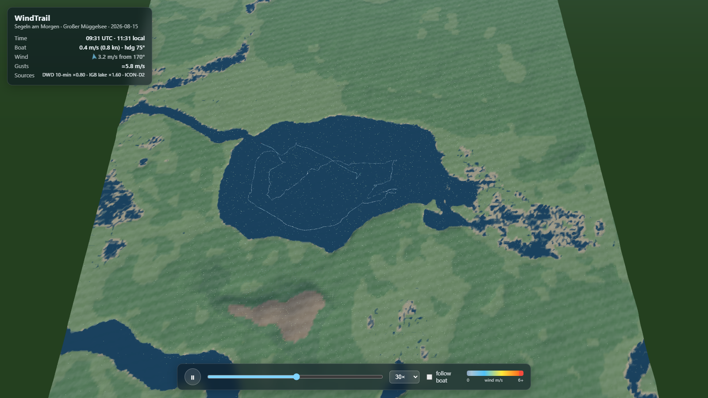

# WindTrail — 3D Sailing Trip + Terrain-Aware Wind Visualization

Interactive Three.js replay of a sailing trip on the Großer Müggelsee (Berlin,
2026-08-15, 06:02–12:52 UTC) on a stylized low-poly 3D terrain, with
MSFS-style animated wind streaks driven by a terrain-aware wind field blended
from three real data sources.



## Quick start

```bash
cd web
npm install
npm run dev        # → http://localhost:5173/
```

Controls: orbit with mouse (or leave **follow boat** on), play/pause, scrub,
1×–120× playback speed. HUD shows boat speed, wind speed/direction and gust
estimate at the boat position.

All data files are pre-baked into `web/public/data/` — no need to rerun the
Python pipeline unless you want to regenerate them.

## Data sources

| Source | What | Where |
|---|---|---|
| `Segeln_am_Morgen.gpx` | Strava GPX, 1 s sampling, 23.8k points | repo root |
| DWD opendata | 10-min measured wind, stations 00427 (Schönefeld) + 00433 (Tempelhof) | `opendata.dwd.de` |
| Open-Meteo | ICON-D2 (2.2 km) hourly forecast at the lake | API |
| IGB Emon | on-lake mean/gust speed, pixel-scraped from 7-day plot PNGs | `emon.igb-berlin.de` |
| AWS Terrarium | elevation tiles (z13) → 256×256 grid | `s3.amazonaws.com/elevation-tiles-prod` |

Note: IGB's raw 15-min data is intranet-only; the public plots were scraped
instead. The plot's direction curve was too sparse/noisy, so wind direction
comes from the DWD/ICON blend and IGB is used for on-lake speed/gust
calibration. OSM/Overpass was rate-limited, so the water mask is
elevation-based (`elevation < lake level`).

## Pipeline (`tools/`, Python)

```bash
pip install -r requirements.txt
python tools/parse_gpx.py       # GPX → web/public/data/track.json (5 s downsample)
python tools/fetch_wind.py      # DWD + Open-Meteo → data/wind_obs.json
python tools/scrape_igb.py      # IGB plot PNGs → data/igb_lake_wind.json (+ debug overlays)
python tools/fetch_terrain.py   # Terrarium tiles → data/terrain.bin + geo.json
python tools/build_field.py     # blend + terrain model → web/public/data/field.bin + meta.json
```

`build_field.py` is the core model:

- **Background wind** per 10-min step: inverse-distance blend of the two DWD
  stations, bias-corrected toward ICON-D2 at the lake (×0.80), scaled to the
  scraped IGB on-lake curve (×1.60). Gust factor 1.80 from the IGB gust curve.
- **Terrain perturbation** on a 120×120 grid (~74 m cells):
  orographic speed-up on windward slopes, lee wind-shadow with exponential
  recovery over ~12× obstacle height (the Müggelberge dead zone in the
  southern lake for southerly winds), deflection around high barriers,
  +12 % roughness over open water, channeling along the lake's ENE–WSW axis.
- Outputs: `field.bin` (Float32 `[55 steps][120][120][u,v]`, ~6.3 MB),
  `meta.json`, `data/field_validation.png` (all sources vs. final estimate),
  `data/field_quiver.png`.

## Web app (`web/`, Vite + Three.js, vanilla JS)

| File | Purpose |
|---|---|
| `src/main.js` | renderer, sky/fog, sun + hemisphere light, orbit/follow camera, playback loop |
| `src/geo.js` | lat/lon → local meters projection (x = east, z = south) |
| `src/terrain.js` | low-poly terrain mesh from `terrain.bin` (vertex colors, flat shading), water plane, ground-height sampler |
| `src/track.js` | speed-colored track ribbon, sailboat marker, time interpolation; shared speed→color scale |
| `src/windParticles.js` | 9,000 wind streak particles advected through `field.bin` (bilinear in space, linear in time, sub-stepped), rendered as fading line trails |
| `src/hud.js` | time/boat/wind/gust readout, playback controls, legend |

Verification screenshots (headless Chrome via puppeteer-core):

```bash
node web/e2e/shot.mjs   # dev server must be running → data/shots/*.png
```

## File layout

```
Segeln_am_Morgen.gpx   input track
requirements.txt       numpy, pillow, requests, matplotlib
tools/*.py             data pipeline (see above)
data/                  intermediates + validation/debug PNGs + shots/
web/public/data/       baked runtime data (track.json, terrain.bin, field.bin, meta.json, geo.json)
web/src/*.js           Three.js app
web/e2e/shot.mjs       headless screenshot verification
```
